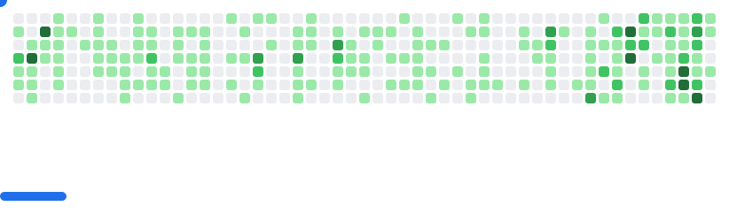

## Hi there, This is Ifti 🐢

<!--
**IFTI612/IFTI612** is a ✨ _special_ ✨ repository because its `README.md` (this file) appears on your GitHub profile.

Here are some ideas to get you started:

- 🔭 I’m currently working on ...
- 🌱 I’m currently learning ...
- 👯 I’m looking to collaborate on ...
- 🤔 I’m looking for help with ...
- 💬 Ask me about ...
- 📫 How to reach me: ...
- 😄 Pronouns: ...
- ⚡ Fun fact: ...

past experiences:
  - ["Sr Robotics Software Engineer", "UAV Swarms", "Technology Innovation Institute", "UAE", "2022-Now"]
  - ["Principal Solutions Engineer", "Web3, AI", "Unchained Labs", "Stealth", "2024-Now"]
  - ["Sr Robotics Software Engineer", "UGV Navigation", "Coalescent Mobile Robotics", "Denmark", "2021-2022"]
  - ["Backend Software Engineer", "Web App Backend (Go/Postgre)", "Hiventive", "Fully Remote", "2020-2021"]
  - ["Robotics Researcher", "AI Planning/Control", "LS2N", "France", "2019-2021]
  - ["Robotics Intern", "UGVs", "Ingeniarius", "Portugal", "2019"]
  - ["Embedded Systems Engineer", "STM32 Virtualization", "Hiventive", "France", "2018-2019"]
  - ["Robotics Intern", "UGVs", "Laboratory of Digital Sciences of Nantes (LS2N)", "France", "2019"]

  fields_of_interests: ["Path Planning", "Trajectory Planning", "Path Following", "Behaviour Planning", 
                      "Localization", "Sensor Fusion", "Embedded Systems"]
technical_background: ["Motion Planning", "Optimization", 
                       "Nonlinear Control", "Real-Time Systems", "Automated Planning"]

-->
## My Info
```yaml
name: Ifti Bin Islam Mahin
located_in: Dhaka ,Bangladesh
education: ["Bachelor's in Computer Science And Engineering"]
currently_learning: ["Web3", "React", "Vue"]
will_learn: ["ML(Computer Vision)"]
hobbies: ["Cricket", "Singing", "Gaming", "Travelling"]
```

## My Activity

  


<picture>
  <source
    media="(prefers-color-scheme: dark)"
    srcset="images/breakout-dark.svg"
  />
  <source
    media="(prefers-color-scheme: light)"
    srcset="images/breakout-light.svg"
  />
  
</picture>


